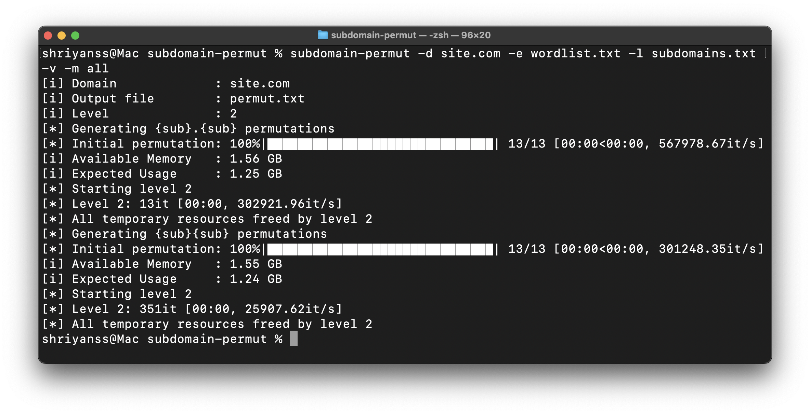

<p align="center">
  <a href="https://pypi.org/project/subdomain-permut" target="_blank"></a>
  <a href="https://pypi.org/project/subdomain-permut/#history" target="_blank"></a>
  <a href="https://github.com/shriyanss/subdomain-permut/actions/workflows/publish.yml"></a>
  
  <a href="https://reddit.com/u/shriyanss" target="_blank"></a>
  </a>
</p>

<p align='center'>
  
  
</p>

# About
subdomain-permut is a powerful subdomain permutation tool designed for serious reconnaissance. It’s optimized to run on VPS setups with ample storage capacity, as its output can be massive—ranging from hundreds of gigabytes to even terabytes depending on the configuration.

With the right options enabled, subdomain-permut can generate nearly every conceivable subdomain a developer might think of. Just generate a permutation file and see for yourself—you might be surprised at what turns up 😉.

## Installation
### Using `pip`
Just run this command, and this tool will be installed:
```bash
pip install subdomain-permut
```

### By cloning the repo
```bash
git clone https://github.com/shriyanss/subdomain-permut.git
cd subdomain-permut
sudo python3 setup.py install
```

## Usage
You can simply run this command, and it will do most of the thigs automatically
```bash
subdomain-permut -l subdomains.txt -d site.com
```

```
usage: subdomain-permut [-h] [--list LIST] [--domain DOMAIN] [--level LEVEL] [--output OUTPUT] [--enrich ENRICH] [--method METHOD] [--ls] [--verbose]

Subdomain permutation tool

optional arguments:
  -h, --help            show this help message and exit
  --list LIST, -l LIST  Subdomains list
  --domain DOMAIN, -d DOMAIN
                        Domain name for the target
  --level LEVEL         Number of iterations to run through (default=2)
  --output OUTPUT, -o OUTPUT
                        Output file name (default=permut.txt)
  --enrich ENRICH, -e ENRICH
                        Enrich using given wordlist
  --method METHOD, -m METHOD
                        Subdomain Permutation methods to use (comma-separated). Run with --ls flag to see the list (default=subdotsub)
  --ls                  List permutation methods
  --verbose, -v         Verbose output
  ```